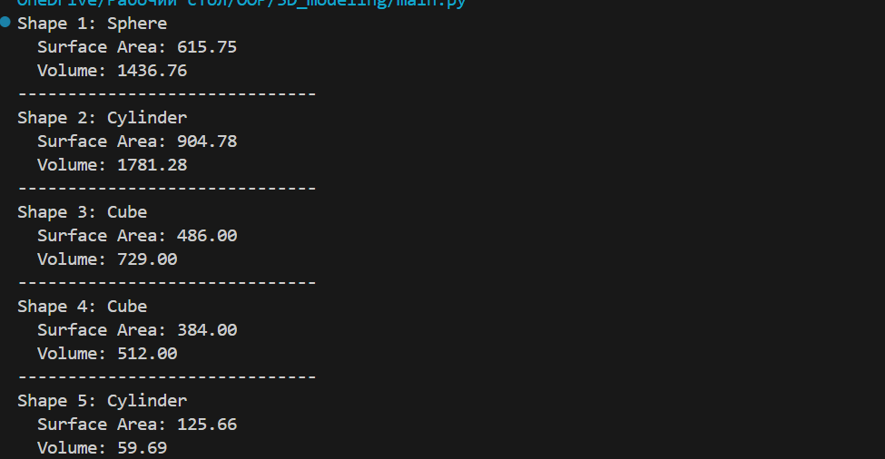
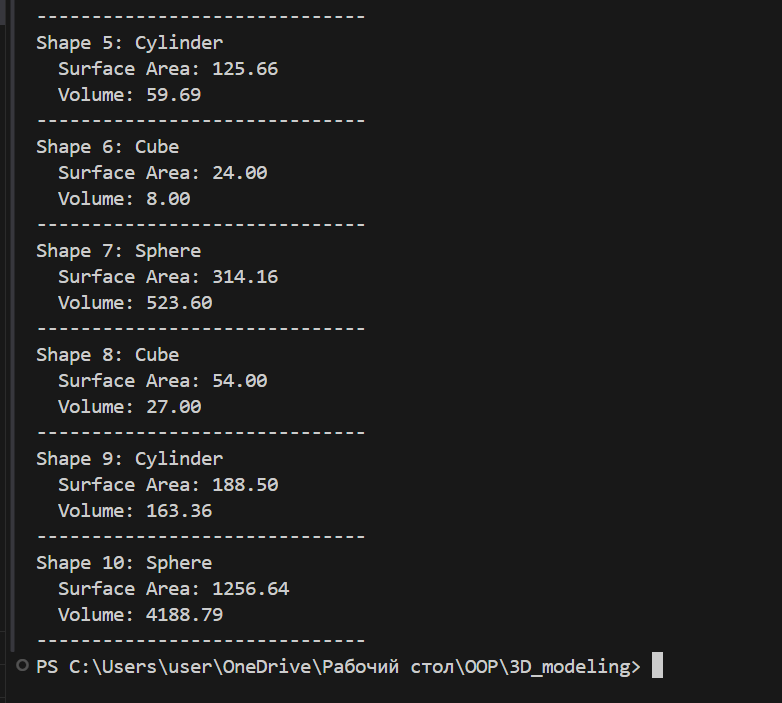

# Abstraction in 3D Shape Modeling

## 📌 Objective

This project demonstrates how abstraction in object-oriented programming can be used to model 3D geometric shapes in Python using abstract base classes.

## 📦 Features

- Abstract base class `Shape3D`
- Concrete shape classes:
  - Sphere
  - Cylinder
  - Cube
- Random generation of shape objects
- Calculation of surface area and volume using polymorphism

## 📄 Classes

### Shape3D (Abstract)
- `surface_area()` - Abstract method
- `volume()` - Abstract method

### Sphere
- Constructor: `Sphere(radius)`
- Implements `surface_area()` and `volume()`

### Cylinder
- Constructor: `Cylinder(radius, height)`
- Implements `surface_area()` and `volume()`

### Cube
- Constructor: `Cube(side)`
- Implements `surface_area()` and `volume()`

## ▶️ Running the Program

```bash
python shape3d.py





